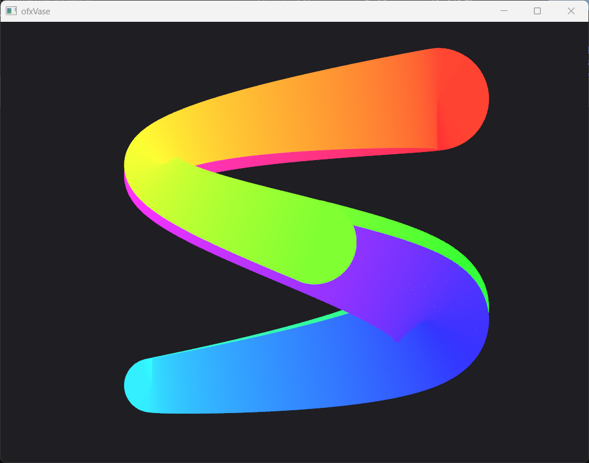

# ofxVase

High-quality polyline rendering for openFrameworks with variable width, color, and smooth joints. Based on the [VASE renderer](https://github.com/tyt2y3/vaserenderer) algorithm by TSANG, Hao Fung for high-quality polyline tessellation.



## Features

- **Variable width** - Each vertex can have a different stroke width
- **Variable color** - Per-vertex colors with smooth interpolation
- **Smooth joints** - Round, Bevel, and Miter joint styles
- **Round caps** - Semicircle end caps with smooth tessellation
- **Catmull-Rom smoothing** - Optional spline interpolation for silky curves
- **Cross-platform** - Uses openFrameworks' native mesh rendering

## How It Works

ofxVase tessellates polylines into triangle meshes with proper geometry for:
- Variable-width strokes
- Rounded joints at turns (prevents gaps and overlaps)
- Semicircular end caps
- Per-vertex color interpolation

All rendering uses standard `ofMesh`, so it works everywhere openFrameworks does.

## Usage

```cpp
#include "ofxVase.h"

void ofApp::draw() {
    // Draw an ofPolyline with uniform width
    ofPolyline line;
    line.addVertex(100, 100);
    line.addVertex(200, 150);
    line.addVertex(300, 100);
    
    ofSetColor(255, 100, 100);
    ofxVase::draw(line, 10.0f);  // 10px width
}
```

### Configure styles

```cpp
void ofApp::setup() {
    ofxVase::setJointStyle(ofxVase::JointStyle::Round);
    ofxVase::setCapStyle(ofxVase::CapStyle::Round);
}
```

### Variable width and color

```cpp
void ofApp::draw() {
    std::vector<glm::vec2> points = {
        {100, 100}, {200, 200}, {300, 150}, {400, 200}
    };
    
    std::vector<ofFloatColor> colors = {
        ofFloatColor::red,
        ofFloatColor::yellow,
        ofFloatColor::green,
        ofFloatColor::blue
    };
    
    std::vector<float> widths = {5, 20, 10, 30};
    
    ofxVase::Options opts;
    opts.joint = ofxVase::JointStyle::Round;
    opts.cap = ofxVase::CapStyle::Round;
    
    ofxVase::Polyline poly(points, colors, widths, opts);
    
    ofEnableAlphaBlending();
    ofDisableDepthTest();  // Important for proper alpha blending
    poly.holder.toMesh().draw();
    ofEnableDepthTest();
}
```

### Using the Renderer (recommended)

```cpp
class ofApp : public ofBaseApp {
    ofxVase::Renderer renderer;
    
    void setup() {
        renderer.setup();
    }
    
    void draw() {
        ofxVase::Polyline poly(points, colors, widths, opts);
        
        renderer.begin();  // Enables alpha blending and depth test settings
        renderer.draw(poly);
        renderer.end();
    }
};
```


### Smoothing (Catmull-Rom Splines)

Enable `opts.smoothing = N` to subdivide each segment N times using Catmull-Rom spline interpolation. This creates smooth curves from fewer control points:

```cpp
opts.smoothing = 4;  // 4 subdivisions per segment = silky smooth curves
```

- `0` = no smoothing (default, straight lines between points)
- `1-2` = subtle smoothing
- `3-5` = smooth curves
- `6+` = very smooth (but more vertices)

## Wishlist / TODO

- [ ] **Shader-based anti-aliasing** - The original VASE renderer uses fragment shaders for feathered edges. We have the shaders in `src/shaders/` but currently have only mesh rendering working. Future: implement VBO path with shader-based AA.
- [ ] **Feathering** - Soft anti-aliased edges without MSAA (requires shader implementation)
- [ ] **Bevel and Miter joints** - Currently only Round joints are implemented (Butt caps work as default)
- [ ] **Performance optimization** - Batch rendering, VBO caching for static polylines
- [ ] **Dashed/dotted lines** - Pattern support
- [ ] **Gradient strokes** - Texture coordinate generation for shader-based gradients

## License

BSD 3-Clause License - See LICENSE.txt

